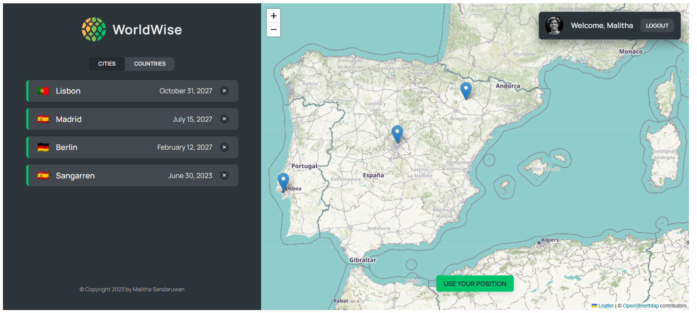
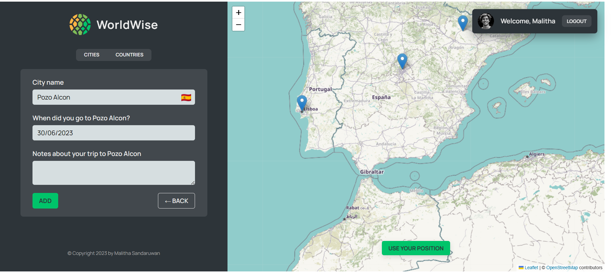
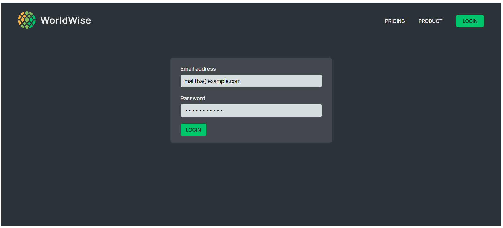

# WORLD WISE APP WITH REACT ROUTER

## DESCRIPTION

- This is a simple app that users can add their visiting cities and countries to the list. Also, they can delete the cities and countries from the list. This app is created with related to the [React Ultimate Course](https://www.udemy.com/course/react-the-ultimate-guide-to-learn-react/) by Jonas Schmedtmann.

## FEATURES

- Search through Map and Get the City Details
- Add City to the List
- Delete City from the List
- Login and Logout
- Geo Location

## SCREENSHOTS






# WHAT I LEARNED

## REDUCER METHOD

- The reducer method is a built-in JavaScript function that is used to `reduce an array to a single value`.
- It takes two arguments: an `accumulator` and a `current value`.

  - The accumulator is the value that is returned after each iteration.
  - The current value is the value of the current element in the array.

- The reducer method is commonly used with the `reduce()` function to perform operations on arrays.

Here's an example of a reducer method that takes an array of objects and returns a new array with only one object per unique country:

```js
const countries = cities.reduce((accumulator, currentvalue) => {
  if (!accumulator.map((item) => item.country).includes(currentvalue.country)) {
    return [...accumulator, currentvalue];
  }
  return accumulator;
}, []);
```

- In this example, the `reduce()` function is used to iterate over the `cities` array and accumulate the unique countries into the `countries` array.
- The `map()` function is used to extract the `country` property from each object in the `accumulator` array and check if it includes the `country` property of the `currentvalue` object.
- If it does not include the `country` property, the `currentvalue` object is added to the `accumulator` array.

## REACT ROUTER

- React Router is a collection of navigational components that compose declaratively with your application.
- You can install it using `npm install react-router-dom`.

### use `<NavLink>` instead of `<Link>`

- `<NavLink>` is a special version of the `<Link>` that will add styling attributes to the rendered element when it matches the current URL.
- For example, if current URL is `/about`, then the element will receive the `active` class name.
- We can select that using CSS (pseudo class) and style it however we want.

### rested routing

- Actually, it is very easy to implement rested routing. All we need to add related nested routes wrapped around parent route.

```js
<Route path='app' element={<AppLayout />}>
  <Route index element={<p>Dashboard</p>} />
  <Route path='cities' element={<p>List of cities</p>} />
  <Route path='countries' element={<p>List of countries</p>} />
  <Route path='form' element={<p>Form</p>} />
</Route>
```

- `index element` is the default route. It will be rendered when the parent route is rendered.
- Now, Where these routes will be rendered? We need to add `<Outlet />` in the relavant component.

### `USEPARAMS` HOOK

- The `useParams` hook allows us to access the `params` from the current route.

```js
const { id } = useParams();
```

### `USESEARCHPARAMS` HOOK

- The `useSearchParams` hook allows us to access the `query string` from the current route.

```js
const [searchParams, setSearchParams] = useSearchParams();
```

- How to get the value of a specific query string?

```
www.example.com/app/cities/lisbon?lat=38.7223&lng=-9.1393
```

```js
const lat = searchParams.get("lat");
const lng = searchParams.get("lng");
```

- How to update the value of a specific query string?

```js
setSearchParams({ lat: 38.7223, lng: -9.1393 });
```

### `USENAVIGATE` HOOK

- The `useNavigate` hook allows us to navigate to a different route.

```js
const navigate = useNavigate();

const handleClick = () => {
  navigate("/app/form");
};
```

### `Navigate` FUNCTION

- This is not comonly used. But there are some cases where we need to use this function. Also, when we can't use hooks, we can use this function.

```js
<Route index element={<Navigate replace to='cities' />} />
```

- `replace` prop will replace the current route with the new route. This will enable us to go back to the previous route using the browser back button.

## URL FOR STATE MANAGEMENT

- Easy way to store state in a `global place`, accessible to `all components` in the app.

- Good way to `pass data` from one page into the next page.

- Makes it possible to `bookmark or share` the page with the exact UI state it had at the time.

### PARAMS AND QUERY STRING

```js
www.example.com/app/cities/lisbon?lat=38.7223&lng=-9.1393
``
```

### GETTING CITY DETAILS FROM THE API

- In order to get the city details from the API. We have used

```
https://api.bigdatacloud.net/data/reverse-geocode-client?latitude=0&longitude=0
```
